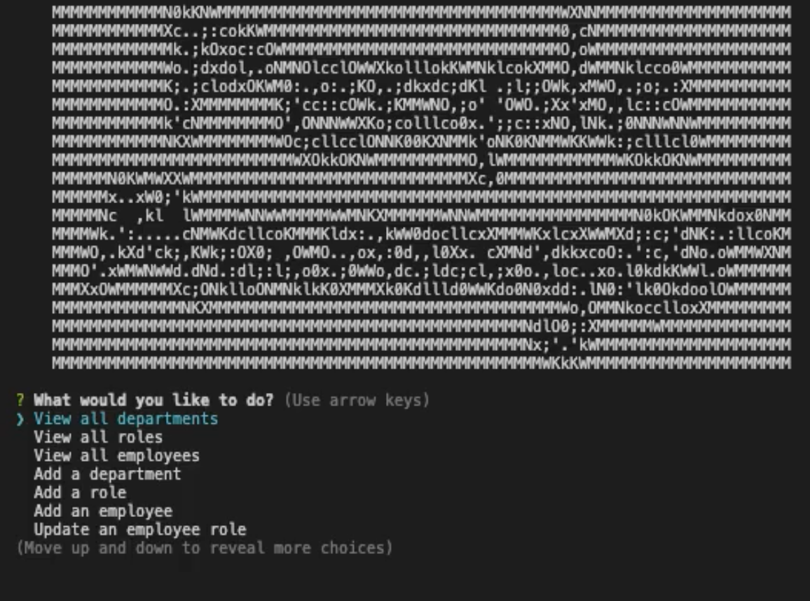

 <h1 id="project-title">People Manager</h1>
 
<!--  -->

<h2 id="table-contents">Table of Contents</h2>

-[Description](#project-desc)

-[Screen Captures](#project-captures)

-[Technology](#project-tech)

-[Installation](#project-inst)

-[Usage](#project-usage)

-[Questions/Contact](#project-contact)

<!-- -[References](#project-ref) -->

<h2 id="project-desc">Description</h2>

The People Manager is a command line tool that makes use of database architecture to manage and update employee data, company roles, and associated department structures. This is used to manage and update associated data in order to aid in company operations.

<a href="#project-title">Back to Top</a>

<h2 id="project-captures">Screen captures</h2>

[See it in action in this video](https://drive.google.com/file/d/1c0VUhqT2cwSIA_OeN9VqeUc-RGJzFmsd/view?usp=sharing)

| Image | Description |
| --- | ----------- |
|   | Application in use |

<h2 id="project-tech">Technology</h2>

- Node.js
- Inquirer.js
- MySQL

<a href="#project-title">Back to Top</a>

<h2 id="project-inst">Installation</h2>

To install the necessary packages, run the following command in your local directory

    `npm i`

It is recommended that you use MySQL to install seed data, otherwise you are free to use your own seed data based on the schema.sql file provided.

<a href="#project-title">Back to Top</a>

<h2 id="project-usage">Usage</h2>
To execute the program, run the following command in your local directory

    `node index.js`

<a href="#project-title">Back to Top</a>

<h2 id="project-contact">Questions / Contact</h2>

- [See more of my work on GitHub](https://github.com/mcjbyday) 

<a href="#project-title">Back to Top</a>

